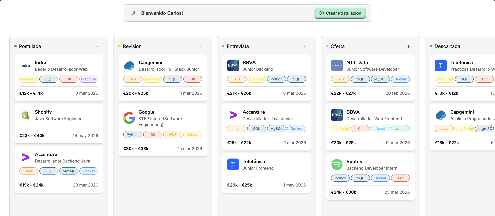

# JobTrackr – Kanban de candidaturas de empleo

JobTrackr es un proyecto intermodular de 1º de DAW: una aplicación web tipo Kanban para organizar y seguir candidaturas de empleo, desde que envías el CV hasta las últimas fases de la entrevista.

El objetivo es aprender y demostrar bases sólidas de programación, bases de datos y desarrollo web usando tecnologías lo más “core” posible, sin frameworks pesados en el backend.


## Objetivo del proyecto

- Permitir que un usuario gestione sus candidaturas en un tablero Kanban (por ejemplo: Por aplicar, Enviado, Entrevista, Oferta, Archivado).
- Practicar el ciclo completo: diseño de base de datos, backend en Java con API REST, frontend web (landing + SPA) y documentación para los distintos módulos del ciclo.
- Preparar el proyecto para poder desplegarlo en producción (Docker, Vercel para el front y Railway para backend + MySQL) aunque pueda ejecutarse sin problema en local.


## Funcionalidades principales (MVP)


El MVP de JobTrackr se centra en:

- CRUD de candidaturas de empleo (crear, listar, actualizar y borrar).
- Tablero Kanban para mover las tarjetas de candidaturas entre columnas mediante drag \& drop.
- Gestión básica de empresas, puestos y estados de la candidatura.
- Landing page que presenta el producto, explica la idea y sirve como “cara pública” del proyecto.

Por simplicidad y por los requisitos de 1º de DAW, el backend no implementa autenticación ni autorización reales; el foco está en el flujo de datos y la arquitectura en capas.


## Arquitectura general del repositorio

El proyecto está organizado como un monorepo con cuatro carpetas principales:

```text
/jobtrackr-intermodular
  /web      → Frontend (landing estática + SPA Kanban)
  /backend  → Servidor Java (API REST con HttpServer)
  /sql      → Scripts SQL (schema, datos de ejemplo, consultas)
  /docs     → Documentación para SSII, IPE, etc.
```

- `/web`: Contiene la parte visual del proyecto. Incluye la landing hecha con HTML, CSS y JavaScript, y la SPA que consume la API del backend.
- `/backend`: Código Java organizado en capas (Model, Repository/DAO, Service, Controller) ejecutado sobre `com.sun.net.httpserver.HttpServer`.
- `/sql`: Scripts obligatorios para el módulo de Bases de Datos: `schema.sql`, `seed.sql` y `queries.sql`.
- `/docs`: Informes técnicos y documentación para Sistemas Informáticos, Entornos, IPE, etc.


## Base de datos: MySQL

La base de datos de JobTrackr está diseñada en MySQL de forma totalmente relacional.

Entidades principales (según el schema y los requisitos del proyecto):

- `usuarios`: Datos básicos del usuario propietario de las candidaturas.
- `empresas`: Empresas a las que se aplican las ofertas.
- `candidaturas`: Candidaturas concretas a un puesto (título del puesto, enlace, salario, etc.).
- `estados`: Estados del Kanban (por ejemplo, “Enviado”, “Entrevista técnica”, “Oferta”, “Rechazado”).
- `entrevistas`: Información de entrevistas asociadas a una candidatura (fecha, tipo, notas).
- `tags` y tablas de relación para etiquetar candidaturas (tecnologías, tipo de contrato, remoto/presencial).
- `historial`: Histórico de cambios de estado de cada candidatura para ver cómo ha ido avanzando.

En `/sql` encontrarás tres scripts principales:

- `schema.sql`: Crea todas las tablas, claves primarias y foráneas.
- `seed.sql`: Inserta datos de ejemplo (usuarios de prueba, empresas españolas, candidaturas con distintos estados, entrevistas y etiquetas).
- `queries.sql`: Incluye consultas típicas que el profesor puede ejecutar (listados, búsquedas, joins y consultas útiles para la “empresa ficticia”).


## Backend: Java Core + JDBC

El backend está desarrollado únicamente con Java Core (JDK) y se ejecuta sobre `com.sun.net.httpserver.HttpServer`, sin usar frameworks como Spring o Jakarta EE.

Características principales:

- Servidor HTTP basado en `HttpServer` con endpoints REST para recursos como candidaturas, empresas y estados.
- Acceso a MySQL vía JDBC usando un `JdbcConnectionPool` para gestionar conexiones de forma eficiente.
- Serialización y deserialización de JSON con `Gson` para enviar y recibir datos desde el frontend.
- Código organizado en capas:
    - **Model**: Clases Java que representan las entidades de la BBDD.
    - **Repository / DAO**: Acceso a la base de datos mediante consultas SQL y JDBC.
    - **Service**: Reglas de negocio (validaciones, transformaciones, etc.).
    - **Controller**: Gestión de las peticiones HTTP y respuesta en formato JSON.

Actualmente no se implementa autenticación ni autorización: todos los endpoints están abiertos para simplificar el proyecto dentro del nivel de 1º de DAW.


## Frontend: Landing + SPA



El frontend vive en la carpeta `/web` y tiene dos “caras” diferentes del proyecto.

### Landing page (presentación)

- Desarrollada con HTML, CSS y JavaScript “vanilla”.
- Funciona como web corporativa que “vende” JobTrackr como si fuera un SaaS (estilo Trello/Notion pero para candidaturas).
- Incluye:
    - Página de inicio explicando el problema que resuelve JobTrackr.
    - Secciones de funcionalidades, posible plan de precios y formulario de contacto.
    - Diseño responsive básico para que se vea bien en móvil y en escritorio.

Esta parte sirve sobre todo para el módulo de Lenguajes de Marcas y Entornos de Desarrollo (buena estructura, estilos, semántica y presentación del proyecto).

### Web App / SPA Kanban

- SPA desarrollada con React, React Router y Tailwind CSS para la parte de aplicación interactiva.
- Implementa el tablero Kanban con drag \& drop usando la librería `dnd-kit`.
- Consume la API REST del backend en Java mediante `fetch` y trabaja siempre con JSON.
- Permite:
    - Listar candidaturas en columnas por estado.
    - Crear nuevas candidaturas mediante formularios.
    - Editar y mover tarjetas entre columnas arrastrando y soltando.

Esta parte está pensada como la “aplicación real” que se conecta al backend y a la base de datos, y sirve para demostrar dominio de programación y buenas prácticas en arquitectura cliente-servidor.


## Ejecución en local (resumen)

Requisitos recomendados:

- Java 21 o superior.
- MySQL 8 o compatible.
- Node.js y npm (para la parte React de la SPA).

Pasos generales:

1. **Clonar el repositorio**

```bash
git clone https://github.com/tu-usuario/jobtrackr-intermodular.git
cd jobtrackr-intermodular
```

2. **Configurar la base de datos MySQL**
    - Crear una base de datos vacía (por ejemplo, `jobtrackr`).
    - Ejecutar `schema.sql` y `seed.sql` en esa base de datos utilizando tu herramienta favorita (Workbench, DBeaver, CLI, etc.).
3. **Configurar el backend**
    - Ajustar las credenciales de la base de datos mediante variables de entorno (por ejemplo: `DB_URL`, `DB_USER`, `DB_PASSWORD`) o un fichero de configuración local ignorado por Git.
    - Abrir la carpeta `/backend` en tu IDE y ejecutar la clase principal que lanza el `HttpServer`.
4. **Levantar el frontend**
    - Landing estática: se puede abrir directamente el `index.html` de `/web` o servir la carpeta con un servidor estático simple.
    - SPA React:

```bash
cd web
npm install
npm run dev
```

Luego acceder a la URL indicada por Vite (normalmente `http://localhost:5173`).

Asegúrate de que la SPA apunte a la URL correcta del backend (por defecto `http://localhost:PUERTO_BACKEND`).


## Despliegue e infraestructura (objetivo)

Aunque el proyecto puede evaluarse ejecutándolo en local, la arquitectura está pensada para poder desplegarlo en:

- **Vercel**: para la parte de frontend (landing + SPA).
- **Railway**: para el backend en Java y el servicio de base de datos MySQL, usando Docker y variables de entorno para credenciales.

Esta parte se documenta en detalle en los informes de `/docs` para el módulo de Sistemas Informáticos (SSII) y Entornos.


## Estado y roadmap

Trabajo ya realizado o planificado:

- [x] Diseño de la base de datos y creación de `schema.sql`.
- [x] Inserción de datos de ejemplo con `seed.sql`.
- [x] Script de consultas `queries.sql` con ejemplos realistas para el contexto de empleo.
- [x] Landing corporativa en `/web` (HTML, CSS, JS).
- [x] SPA Kanban completamente integrada con el backend (React + Tailwind + dnd-kit).
- [ ] Dockerización y despliegue en Vercel (front) y Railway (backend + MySQL).
- [ ] Documentación final completa en `/docs` para todos los módulos.

## Autor y contexto académico

Este proyecto forma parte del ciclo formativo de **Desarrollo de Aplicaciones Web (1º DAW)** y está diseñado para sumar en varios módulos a la vez: Lenguajes de marcas, Programación, Bases de Datos, Entornos de Desarrollo, Sistemas Informáticos e Itinerario Personal para la Empleabilidad.

La idea es que JobTrackr no sea solo un ejercicio de clase, sino también una pieza de portfolio útil para futuras entrevistas de trabajo en el sector del desarrollo de software.
