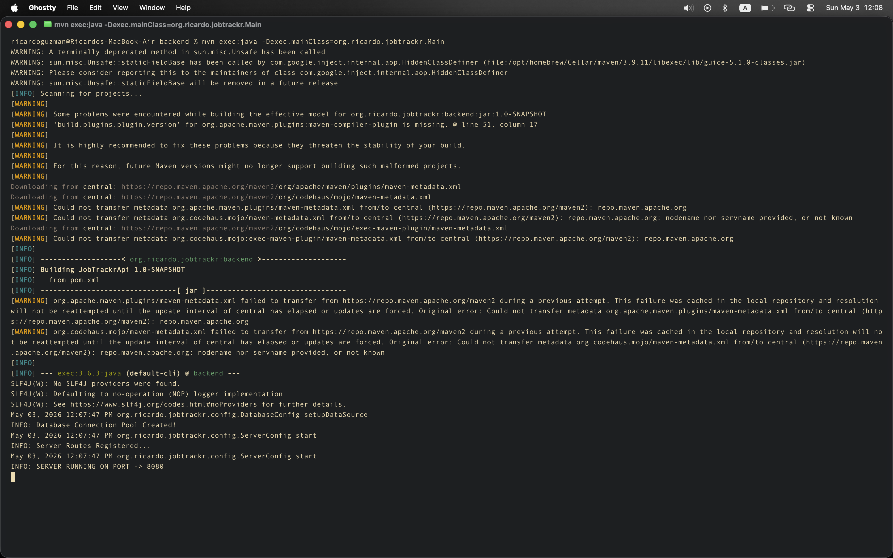
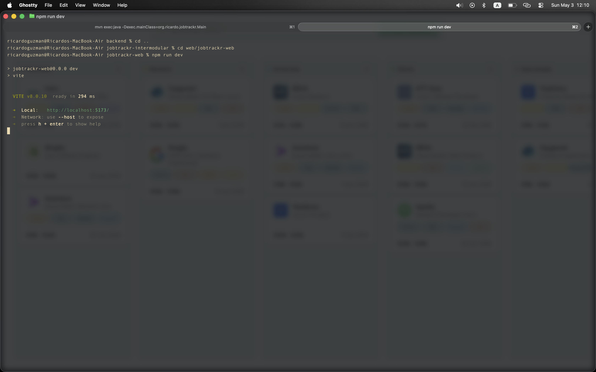

# Informe Técnico de Entorno de Ejecución - JobTrackr

## 1. ¿Qué es este proyecto?

JobTrackr es una aplicación web para hacer seguimiento de candidaturas de
empleo. El usuario puede ver sus postulaciones en un tablero tipo Kanban,
moverlas entre columnas según el estado (Postulada, Revisión, Entrevista,
Oferta...) y guardar información sobre cada proceso.

La aplicación tiene tres partes:

- **Landing page:** páginas HTML/CSS/JS que explican el producto.
- **Backend:** servidor Java con `HttpServer` que expone una API REST. Usa Gson
  para manejar JSON y JDBC para conectarse a MySQL.
- **Base de datos:** MySQL 8.0 con tablas para usuarios, empresas,
  postulaciones, entrevistas, etiquetas e historial de estados.

---

## 2. ¿Dónde se ejecuta la aplicación?

La aplicación está pensada para ejecutarse en el **ordenador personal del
desarrollador o del profesor**.

No hace falta ningún servidor externo. Con tener Java, MySQL y Node.js
instalados en el ordenador es suficiente para levantar todo.

---

## 3. Requisitos del hardware

### Mínimos

| Componente     | Mínimo              |
| -------------- | ------------------- |
| CPU            | Dual-core a 1.8 GHz |
| RAM            | 4 GB                |
| Almacenamiento | 2 GB libres         |

### Recomendados

| Componente     | Recomendado                  |
| -------------- | ---------------------------- |
| CPU            | Quad-core a 2.5 GHz o más    |
| RAM            | 8 GB o más                   |
| Almacenamiento | SSD con al menos 5 GB libres |

Al ejecutar la aplicación se levantan tres procesos a la vez: el servidor Java,
MySQL y el servidor de desarrollo de Vite (React). Con 4 GB de RAM el ordenador
puede con eso, pero con 8 GB va más fluido.

---

## 4. Sistema operativo recomendado

**Sistema recomendado: Ubuntu 22.04 LTS** (o 24.04 LTS).

También funciona perfectamente en **Windows 10/11** o **macOS 13+**.

Se recomienda Ubuntu por estas razones:

- La instalación es más sencilla y sin problemas raros de configuración. El manejador de paquetes de Linux es muy sencillo de usar.
- La terminal de Linux (Bash) es más cómoda para lanzar los comandos del
  proyecto que PowerShell en Windows.

Dicho esto, la guía de instalación del siguiente apartado incluye los comandos
para los tres sistemas operativos.

---

## 5. Cómo instalar y ejecutar el proyecto

### Paso 1 - Instalar Git

**Ubuntu:**

```bash
sudo apt update && sudo apt install git -y
git --version
```

**Windows:** Descargar desde https://git-scm.com e instalar con las opciones por
defecto.

**macOS:**

Si tienes HomeBrew instalado:

```bash
brew install git
```

Si no tienes HomeBrew instalado, Apple tiene un paquete binario de git con
`Xcode Command Line Tools`:

```bash
xcode-select --install
```

---

### Paso 2 - Instalar Java JDK 21

**Ubuntu:**

```bash
sudo apt install openjdk-21-jdk -y
java -version
```

**Windows / macOS:** Descargar el instalador de
[Adoptium Temurin 21](https://adoptium.net/) y seguir el asistente.

---

### Paso 3 - Instalar MySQL 8.0

**Ubuntu:**

```bash
sudo apt install mysql-server -y
sudo systemctl start mysql
sudo mysql_secure_installation
```

**Windows:** Descargar desde https://dev.mysql.com/downloads/installer/ y elegir
"MySQL Server 8.0". El asistente pide crear una contraseña para el usuario
`root`.

**macOS:**

```bash
brew install mysql
brew services start mysql
```

Para verificar que está corriendo:

```bash
mysql --version
```

---

### Paso 4 - Instalar Node.js 20 LTS

**Ubuntu:**

```bash
curl -fsSL https://deb.nodesource.com/setup_20.x | sudo -E bash -
sudo apt install nodejs -y
node --version
```

**Windows / macOS:** Descargar desde https://nodejs.org (versión LTS).

---

### Paso 5 - Clonar el repositorio

```bash
git clone https://github.com/ricard0g/jobtrackr-intermodular.git
cd jobtrackr
```

La estructura del proyecto es:

```
jobtrackr-intermodular/
|-- web/
|   |-- landing/ <- Aqui esta la landing page de jobtrackr
|   |-- jobtrackr-web/ <- Aqui esta la SPA con React
|-- backend/
|-- sql/
|   |-- schema.sql
|   |-- seed.sql
|   |-- queries.sql
|   |-- README.md
|   |-- diagramas/
|-- docs/
|   |-- sistemas/
|   |-- empleabilidad/
```

---

### Paso 6 - Configurar la base de datos

Abrir una terminal y entrar a MySQL como administrador:

```bash
mysql -u root -p
```

Crear la base de datos y el usuario de la aplicación:

```sql
CREATE DATABASE IF NOT EXISTS JobTrackr;
CREATE USER 'jobtrackr_user'@'localhost' IDENTIFIED BY 'jobtrackr_password';
GRANT ALL PRIVILEGES ON JobTrackr.* TO 'jobtrackr_user'@'localhost';
FLUSH PRIVILEGES;
EXIT;
```

Ejecutar los scripts SQL para crear las tablas e insertar datos de ejemplo:

```bash
mysql -u jobtrackr_user -p JobTrackr < sql/schema.sql
mysql -u jobtrackr_user -p JobTrackr < sql/seed.sql
```

Para comprobar que las tablas se crearon:

```bash
mysql -u jobtrackr_user -p JobTrackr -e "SHOW TABLES;"
```

Debe aparecer: `empresas`, `entrevistas`, `etiquetas`, `historial_estatus`,
`postulaciones`, `postulaciones_etiquetas`, `usuarios`.

---

### Paso 7 - Arrancar el backend Java

Primero hay que definir las variables de entorno con las credenciales de la base
de datos. El código Java las lee con `System.getenv()` para no tener contraseñas
escritas directamente en el código.a

**Linux / macOS:**

```bash
export DB_URL="jdbc:mysql://localhost:3306/JobTrackr"
export DB_USER="jobtrackr_user"
export DB_PASSWORD="jobtrackr_password"
export PORT=8080
```

**Windows (PowerShell):**

```powershell
$env:DB_URL="jdbc:mysql://localhost:3306/JobTrackr"
$env:DB_USER="jobtrackr_user"
$env:DB_PASSWORD="jobtrackr_password"
$env:PORT=8080
```

Compilar y ejecutar:

```bash
cd backend
./mvnw clean package -DskipTests
java -jar target/jobtrackr-backend.jar
```

Si todo va bien, la consola debe mostrar algo así:

```
[JobTrackr] Servidor iniciado en http://localhost:8080
[JobTrackr] Conexión a base de datos establecida correctamente.
```

---

### Paso 8 - Arrancar el frontend React

```bash
cd frontend
npm install
echo "VITE_API_URL=http://localhost:8080" > .env
npm run dev
```

Abrir el navegador en **http://localhost:5173** para usar la aplicación.

---

## 6. Usuarios y permisos

### Usuarios

| Usuario          | Permisos                                | Para qué sirve                                        |
| ---------------- | --------------------------------------- | ----------------------------------------------------- |
| `root`           | Superadministrador                      | Solo para tareas de administración del servidor MySQL |
| `jobtrackr_user` | Solo sobre la base de datos `JobTrackr` | Es el usuario que usa la aplicación Java              |

Se usa un usuario separado (`jobtrackr_user`) en lugar de `root` por seguridad.
Si alguien accediera al código del backend, solo podría afectar a la base de
datos de JobTrackr, no a otras bases de datos del servidor. Esto se llama
**principio de mínimo privilegio**.

### Dónde se guardan los datos

| Tipo de dato                                 | Dónde está                                          |
| -------------------------------------------- | --------------------------------------------------- |
| Datos de la app (postulaciones, empresas...) | Base de datos MySQL, esquema `JobTrackr`            |
| Código fuente                                | Carpeta `~/jobtrackr/` (repositorio local y GitHub) |
| Copias de seguridad                          | Ver el apartado de mantenimiento                    |

---

## 7. Mantenimiento básico

### Actualizaciones

| Qué actualizar               | Cada cuánto                      | Cómo                                  |
| ---------------------------- | -------------------------------- | ------------------------------------- |
| Sistema operativo Ubuntu     | Diario | `sudo apt update && sudo apt upgrade` |
| MySQL                        | Cada 3 meses                     | `sudo apt upgrade mysql-server`       |
| Dependencias Node (frontend) | Al empezar cada fase             | `npm audit fix`                       |

### Copias de seguridad

Para hacer un backup de la base de datos:

```bash
mysqldump -u jobtrackr_user -p JobTrackr > backup_jobtrackr_$(date +%Y%m%d).sql
```

Esto genera un archivo como `backup_jobtrackr_20260502.sql` con toda la base de
datos. Conviene hacerlo antes de cualquier cambio importante en el esquema.

Para restaurar un backup:

```bash
mysql -u jobtrackr_user -p JobTrackr < backup_jobtrackr_20260502.sql
```

### Qué hacer si algo falla

| Problema                                  | Causa más probable                | Solución                                               |
| ----------------------------------------- | --------------------------------- | ------------------------------------------------------ |
| El backend no arranca                     | MySQL no está corriendo           | `sudo systemctl start mysql`                           |
| Error "Access denied" en la base de datos | Variables de entorno no definidas | Volver al Paso 7 y definirlas de nuevo                 |
| Error "Unknown database JobTrackr"        | No se ejecutaron los scripts SQL  | Ejecutar `schema.sql` y `seed.sql`                     |
| El frontend no carga datos                | El backend no está arrancado      | Verificar que el servidor Java corre en el puerto 8080 |
| Puerto 8080 ocupado                       | Otro proceso usa ese puerto       | `lsof -i :8080` para ver qué es y cerrarlo             |

---

## 8. Evidencias de funcionamiento

Las capturas de pantalla se encuentran en `/docs/sistemas/capturas/` dentro del
repositorio.

| Qué muestra                                                                      | Archivo                                     | Imagen                                                                                                                                   |
| -------------------------------------------------------------------------------- | ------------------------------------------- | ---------------------------------------------------------------------------------------------------------------------------------------- |
| Terminal con el servidor Java arrancado y la conexión a MySQL confirmada         | `captura-ejecucion-backend-terminal.png`    |            |
| Navegador en `localhost:5173` con el tablero Kanban y las postulaciones cargadas | `captura-ejecucion-frontend-navegador.png`  |  |
| Terminal enseñando el servidor frontend en ejecución                             | `captura-ejecución-frontend-terminal.png`   |                               |
| Respuesta JSON de la API: `GET http://localhost:8080/api/postulaciones`          | `captura-peticion-get-ejemplo-terminal.png` |          |
