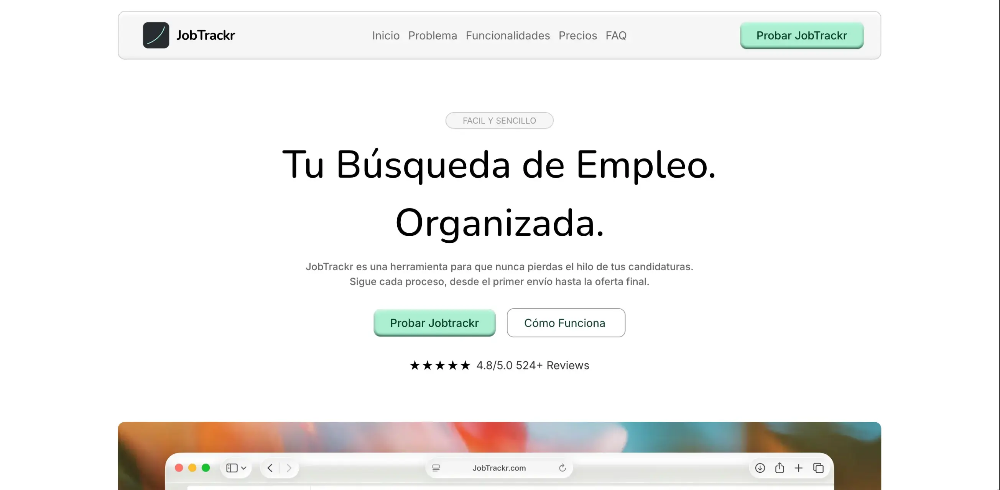

# JobTrackr Landing Page

👉 [JobTrackr en Vivo](https://jobtrackr-landing-page.vercel.app)

> _JobTrackr_ es el Sistema Operativo para conseguir empleo. Ayuda a hacer seguimiento de cada fase, de cada entrevista y de cada candidatura a la que aplica el usuario.

## Secciones De La Landing

| Sección         | Contenido                                                                                                                                                            |
| --------------- | -------------------------------------------------------------------------------------------------------------------------------------------------------------------- |
| Inicio          | Hero Section. Con un titulo llamativo que expresa rapidamente lo que hace JobTrackr + CTA                                                                            |
| Funcionalidades | Enseña funcionalidades principales de la app, dando sencillas visualizaciones sobre el diseño                                                                        |
| Precio          | Mítica sección de precios donde en este caso solo hay uno. Gratuito para todos los desempleados                                                                      |
| FAQ/Contacto    | Dos secciones en una. A la izquierda estan las _Preguntas Frecuentes_ y a la derecha el formulario de contacto.                                                      |

> _Nota: todas las animaciones de la seccion **Problema** estan hechas por mi usando [Cavalry](https://cavalry.studio/en/). Mi primera vez haciendo animaciones, esta nota es un poco por la cara no voy a mentir._

## Algunos retos durante el desarrollo

#### **La Transparencia de las animaciones**:

Al parecer los navegadores manejan distintos codecs (o combinaciones entre formato y codec) para reproducir videos.

Puede darse el caso de tener un **Navegador A** que tenga soporte para el codec VP9 y que un **Navegador B** tambien coporte ese codec.

Pero, aun teniendo los dos soporte para ese mismo codec, que el **Navegador A** no tenga soporte para el canal _Alpha_ de ese codec (que es el canal que añade la transparencia).

En este caso pasa justo eso y hay dos bandos:

- **Safari**
- **Chromium/Firefox**

**Safari, Chromium y Firefox** en este caso tienen soporte para el Codec VP9. Codec que utilicé en un principio para exportar todos los videos de las animaciones a formato _.webm_. Esto era lo que tenia en un principio:

```html
<video src="/assets/animation.webm" ...></video>
```

transparente con el que exporté el video no se estaba viendo reflejado, en cambio estaba poniendo un fondo negro feo detras de la animación.

Esto se debe a que el codec de **Safari** soporta VP9 como codec pero no el canal _Alpha_ de éste, que es el que da soporta a la transparencia.

**La Solución: Quicktime ProRes 4444 + HEVC con Canal Alpha**

La solución involucra dos pasos:

1. Desde Cavalry se puede hacer la exportación de la animación con el codec Quicktime ProRes 4444 (formato proporcionado por Apple) y en formato _.mov_. Esto de por sí tampoco va a funcionar ya que el codec Quicktime ProRes 4444 no está hecho para navegadores (ni siquiera en **Safari**), por lo que el vídeo no se reproduce en lo absoluto.
2. Usando [Shutter Encoder](https://www.shutterencoder.com/) (una interfaz que usa FFMPEG por detras) pasé el codec del video de QuickTime ProRes 4444 a HEVC con el canal Alpha activado. Esto nos dará un video con el mismo formato _.mov_ pero el codec utilizado ahora es HEVC con el canal Alpha, este codec (con el canal Alpha) si es soportado por **Safari**, que es lo que queremos.

Ahora simplemente tenemos que añadir los dos videos como fuentes disponibles
para la etiqueta `<video>`:

```html
<video
	width="800px"
	height="460px"
	...
>
	<source
		src="./assets/hoja-calculo-animation-hd_1.mov"
		type="video/mp4; codecs=hvc1"
	/>
	<source src="./assets/hoja-calculo-animation-hd.webm" type="video/webm" />
</video>
```

Lo que determinará cuál vídeo se va a reproducir es el atributo `type` de las etiquetas `<source>`.

Aqui ponemos el tipo de archivo multimedia y podemos poner tambien el tipo de codec. El navegador escoge cuál vídeo usará en base a este atributo `type`.
## Cómo abrirla/visualizarla

Hay 2 opciones:

1. Ver la landing en este enlace 👉 [JobTrackr en Vivo](https://jobtrackr-landing-page.vercel.app)
2. Hacer click [Aqui](https://github.com/ricard0g/jobtrackr-intermodular/archive/refs/heads/main.zip) para descargar el zip del repositorio. Descomprimir el archivo _.zip_, ir a la carpeta `/web/landing/` y hacer doble click en el archivo `index.html`.
